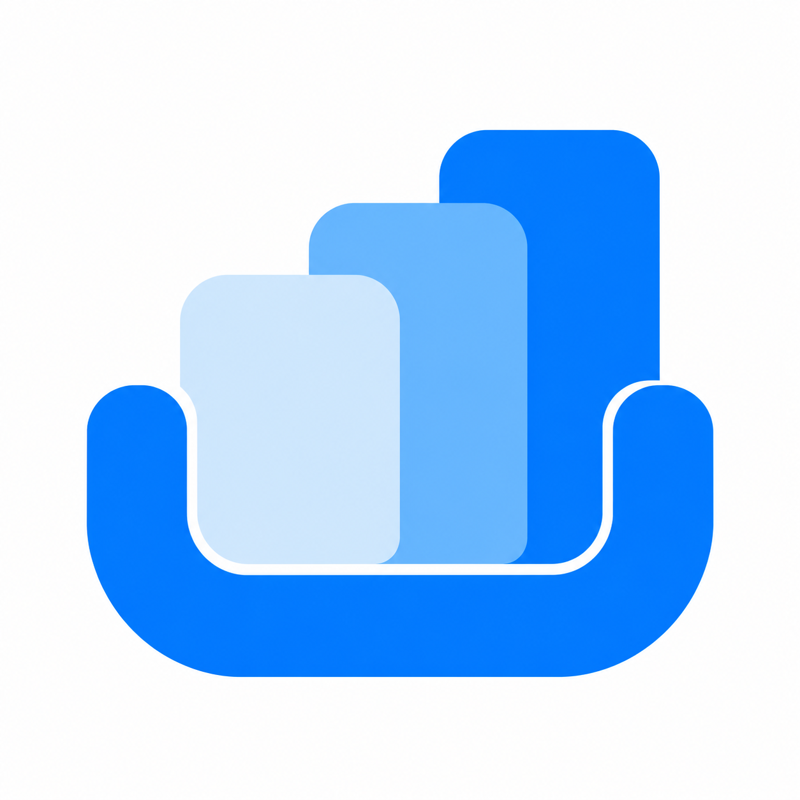
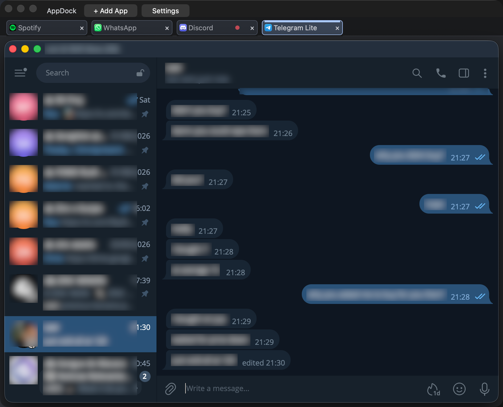
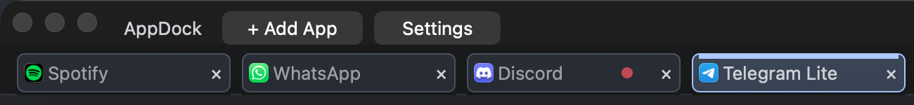

  

<h1 align="center">AppDock</h1>

Your Mac apps, together in one tabbed workspace.

Keep your open app windows organized and switch between them with a click.

**[Download for Mac](https://github.com/ohaddahan/appdock/releases)** · macOS 12 or later

## Features

- **Apps as tabs** — bring open windows into one workspace.
- **Make it yours** — drag tabs to reorder them; double-click to rename.
- **Stay informed** — see notification counts or dots from your apps’ Dock badges.
- **Move together** — move or resize AppDock to keep your windows in place.
- **Choose your startup apps** — automatically add windows from apps you already have open.
- **Keep apps running** — remove a tab or close AppDock without quitting your apps.

## Take a look

**Four apps, one workspace.** Keep WhatsApp, Spotify, Telegram, and Discord together.

**Your tabs at a glance.** See app icons, the selected tab, and notification badges.

*Captured from a real workspace. Telegram names, profile pictures, and messages are blurred for privacy.*

## Get started

1. Download the ZIP for your Mac: **arm64** for Apple Silicon (M-series), or **x86_64** for Intel.
2. Unzip it, move **AppDock.app** to Applications, and open it.
3. Allow AppDock in **System Settings → Privacy & Security → Accessibility** so it can arrange your windows. Return to AppDock and click **Resume**.
4. Open the apps you want to use, then click **+ Add App** to add their windows.

In **Settings**, choose which running apps to add next time. AppDock starts with an empty workspace until you choose startup apps.

Downloaded builds aren’t notarized by Apple, so macOS may ask you to approve opening the app.

## Good to know

- AppDock works on one desktop at a time. If docking pauses after fullscreen, a dialog, or a desktop change, return and click **Resume**.
- Notification badges depend on what each app shows in the Dock.
- AppDock organizes existing windows; it doesn’t launch apps or create separate accounts.

For building, testing, and technical details, see the [developer guide](docs/DEVELOPMENT.md).
